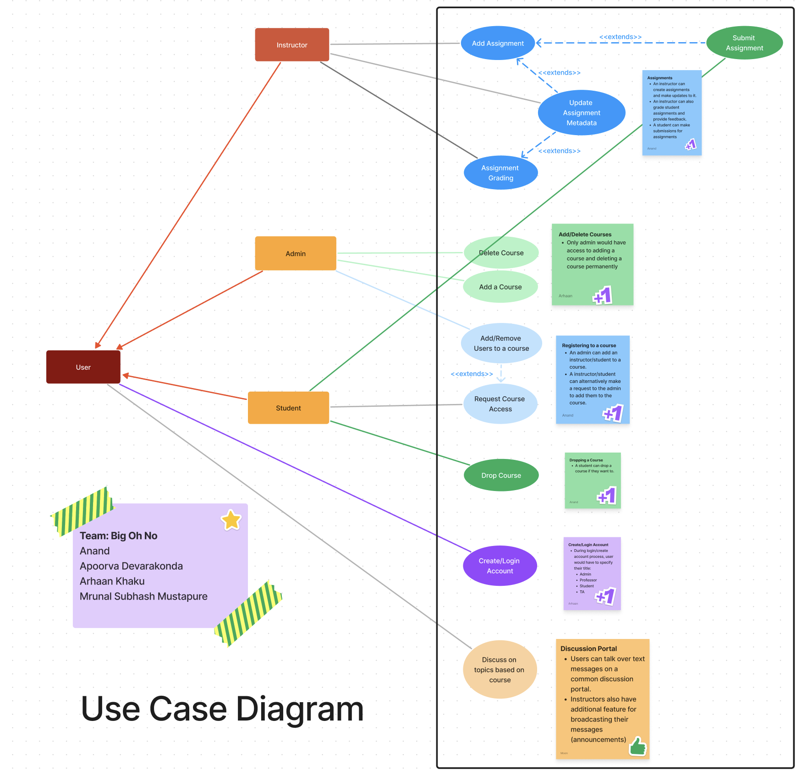
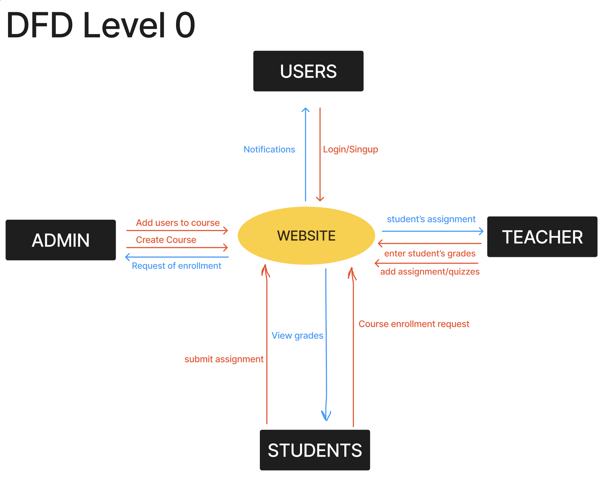
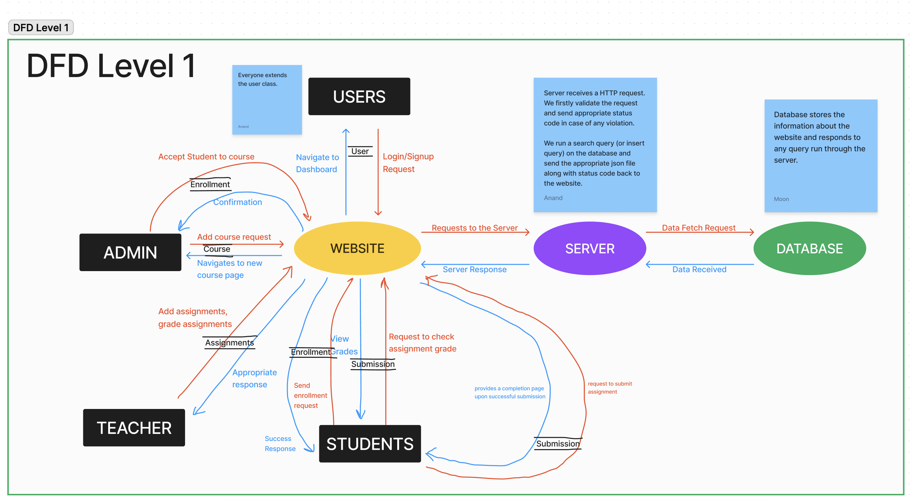

## Use case diagram for the project.

<a href = "https://www.figma.com/file/QlaRz1jaZd1k4zcDKb3YAw/Scrum-1?type=whiteboard&node-id=0%3A1&t=lrhsB0OkQFoYY4I1-1">

</a>


 ## DFD Level 0


## DFD Level 1



## Getting Started
To run the frontend, first install the packages in `node_modules` directory by running
```sh
npm install
```
and then run
```sh
npm run start
```
to run the react app on `localhost:3000`.


